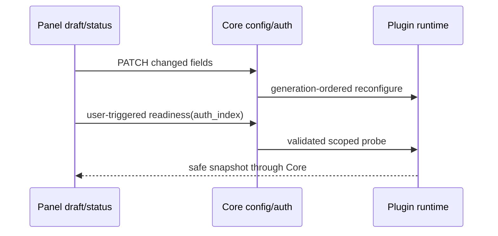

# 插件管理：配置、手动账号与就绪检查

## 产品规则

沿用 /plugins、现有 ConfigFields 编辑器、/auth-files 上传；不为单个供应商另建管理系统，不自动发模型或额度请求。Core 提供能力和事实，Panel 只保留未保存草稿及本次查询结果。

- Core /plugins 的 supports_auth、auth_provider、supports_readiness、executor_provider 都是可选增量字段。旧 Core 缺字段则隐藏就绪操作，不能推断支持。
- auth-only 插件显示“手动账号导入”，不显示 OAuth；跳转已有账号页面上传引用文件，不读取或存储原始凭据。
- “检查就绪”打开 Sheet，加载账号列表但不自动 probe。可选该 provider 的已启用账号；点击按钮调用 GET /plugins/:id/readiness?auth_index=...。
- 展示五层状态、版本和安全消息，明确已注册≠本地就绪≠远端请求/计费已验证。总 Ready 仅取后端布尔值，未知状态不能当成功。
- 不自动轮询；关闭、换插件或切换连接时旧响应不得更新当前 UI。语言切换只更新文案，不废弃当前诊断或使检查按钮永久停在 loading。无账号时可查 provider 范围，但不得声称账号已配置。
- 配置修改仍使用既有 PATCH，只写 touched 字段，保留未知字段。布尔字段区分未设置（继承）、true、false；enum 可清除为继承，清除发送 null，由 Core 删除该键。私有文件路径是服务端路径，不是浏览器上传内容。

## 所有者

## 验收

单测覆盖增量字段解析、旧宿主兼容、账号筛选、ready/unknown、不展开凭据、布尔与枚举继承清除；复用 API client 已有连接 generation 测试。四语言文案同步，保留完整 usage 与 capability gate。

实际本地 Core + synthetic Go 插件验收覆盖：手动账号标签、打开不自动诊断、provider-only 不就绪、选账号本地就绪、关闭、配置保存及回读。桌面 1280×720 已截图检查；手机 390×844 的真实 DOM/交互与横向边界已检查，截图工具超时，不冒充完成手机视觉验收。文件选择上传受当前浏览器能力限制未执行，复用现有 Auth Files 上传路径；旧宿主隐藏和跨连接延迟响应由单测/既有 API generation 测试及挂载边界检查覆盖，不声称已执行对应独立浏览器场景。

“配置已保存”表示既有 PATCH 持久化成功，不证明异步 reconfigure 已成功。查看 Registered/Effective，并手动诊断后再使用；插件拒绝重配置时宿主仍采用既有 reload 语义，Panel 不增加第二份运行态或自动推理请求。未部署生产。
